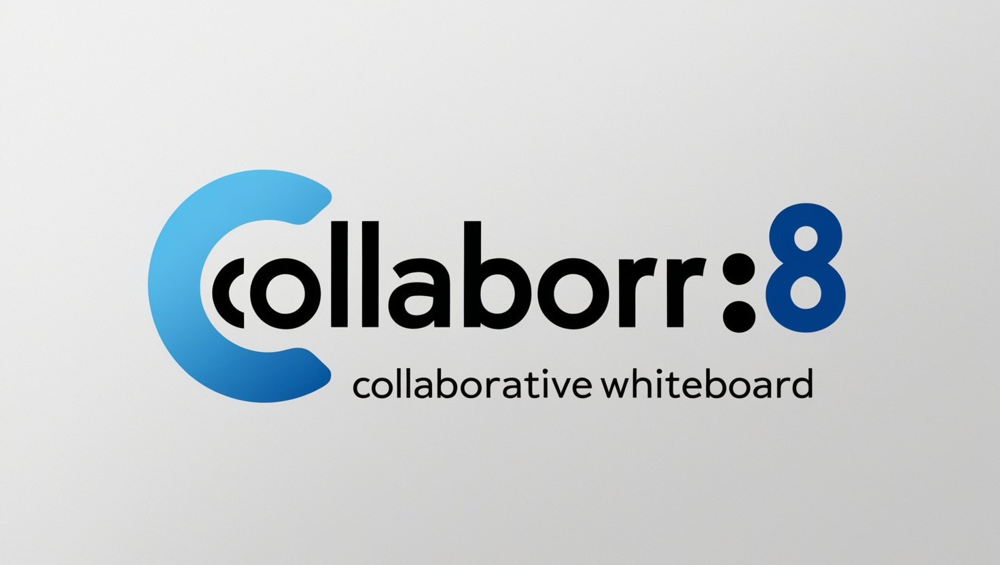

# Project collabor8
<p align="center">
    
</p>

Built with Go (Golang), gRPC, and WebRTC, Collaor8 is web application where multiple users can draw on a shared whiteboard in real time, with low latency and high reliability.

## Getting Started

These instructions will get you a copy of the project up and running on your local machine for development and testing purposes. See deployment for notes on how to deploy the project on a live system.

## MakeFile

run all make commands with clean tests
```bash
make all build
```

build the application
```bash
make build
```

run the application
```bash
make run
```

Create DB container
```bash
make docker-run
```

Shutdown DB container
```bash
make docker-down
```

live reload the application
```bash
make watch
```

run the test suite
```bash
make test
```

clean up binary from the last build
```bash
make clean
```